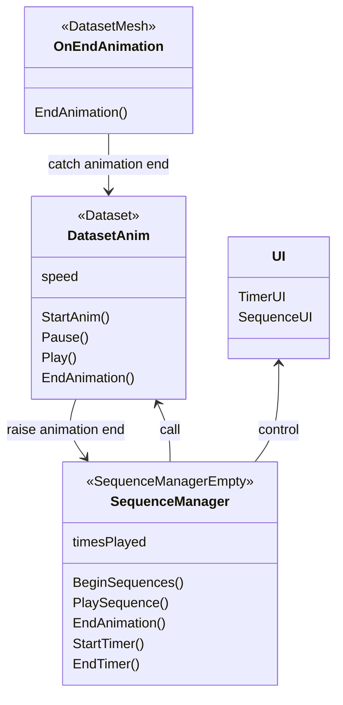

# Software for the part of the experiment in VR

This software first present a main menu.

From the main menu, one can access a tutorial screen where participants learn how to play and pause the animation of 3d model of a cat, to grab items and to put them on green platforms in order to sort them.

From main menu, one can also setup the ID of the participant and select the dataset to display.

When a participant click on "Start Experiment" the selected dataset is diplayed to them in the sequence screen. They can pause the animation and move around it.
The animation of the dataset is showed 3 times, spaced by a 5 second delay.
At the end of the 3 sequences, the participant goes to the sorting screen.

In the sorting screen, 14 global shapes are shown in front of the participant. 7 numbered sorting platforms are on the ground.
Participants can grab items, manioulate them and put them on the green platforms.
Once the items are sorted, a button appears proposing participants to validate their choices.

# Files

```
.
├── Assets
│   └── dataset                # 3d files for the 1st dataset
│   │   └── false              # 3d files for the false answers of the 1st dataset
│   │   │   └── false1.obj
│   │   │   └── false2.obj
│   │   │   ...
│   │   └── true               # 3d files for the true answers of the 1st dataset
│   │   │   └── true1.obj
│   │   │   └── true2.obj
│   │   │   ...
│   │   └── cell_dataset.dae   # The dataset in collada format
│   └── dataset_2              # Contains 3d files for the 1st dataset (same structure as dataset)
│   └── Scripts                # Scripts
│   └── Scene
│   │   └── VR Sequence Scene
│   │   └── VR Sorting Scene  
│   │   └── VR Tutorial Scene  
...
└── README.md
```


