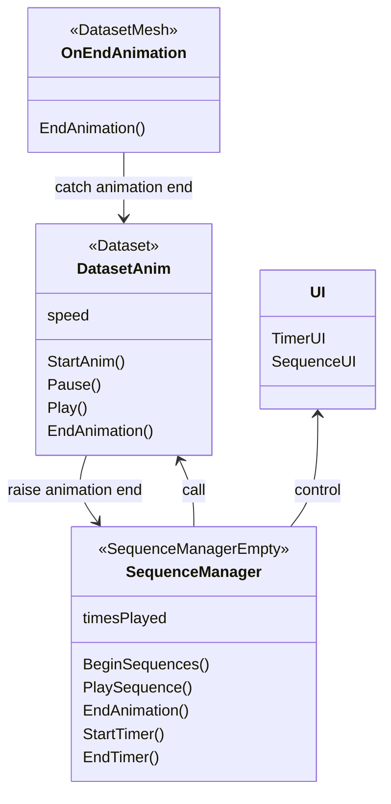

# Architecture

```mermaid
classDiagram
class SequenceManager{
    <<SequenceManagerEmpty>>
    timesPlayed
    BeginSequences()
    PlaySequence()
    EndAnimation()
    StartTimer()
    EndTimer()
}
class DatasetAnim{
    <<Dataset>>
    speed
    StartAnim()
    Pause()
    Play()
    EndAnimation()
}
class OnEndAnimation{
    <<DatasetMesh>>
    EndAnimation()
}

class UI{
    TimerUI
    SequenceUI
}

OnEndAnimation-->DatasetAnim : catch animation end
DatasetAnim --> SequenceManager : raise animation end
DatasetAnim <-- SequenceManager : call
UI <-- SequenceManager : control
```

