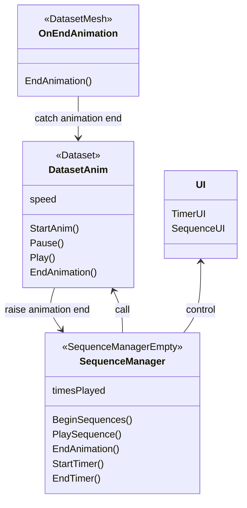

# Software for the part of the experiment on computer

This software first present a main menu.

From the main menu, one can access a tutorial screen where participants learn how to play and pause the animation of 3d model of a cat and drag and drop items from green platforms to red platforms in order to sort them.

From main menu, one can also setup the ID of the participant and select the dataset to display.

When a participant click on "Start Experiment" the selected dataset is diplayed to him. They can rotate, zoom and pause the animation.
The animation of the dataset is showed 3 times, spaced by a 5 second delay.
At the end of the 3 sequence, the participant goes to the sorting screen.

In the sorting screen, 14 englobing shapes are shown to the participant in the upper part of the screen. 7 sorting platforms are in the lower part of the screen.
Participants can drag and drop items, make the items return to their initial position and focus on a specific item.
When an item is focused, it is displayed in the middle of the screen, and participants can rotate it and zoom.
Once the items are sorted, a button appears proposing participants to validate their choices.

# Files

```
.
├── dir1
├── dir2
│   └── file23.ext
└── README.md
```



